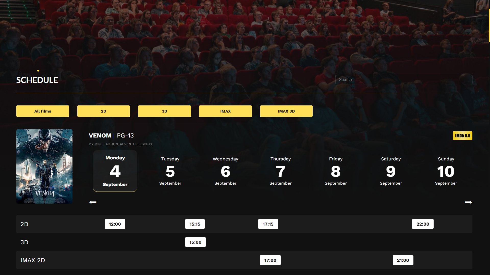

# Luminary Cinema


## Overview

**Luminary** is a passion project born out of a deep love for cinema and the magic of movies. It's an imaginary cinema brought to life through an eye-candy, user-friendly, and intuitive website design.

At Luminary, every visitor is a VIP, welcomed into an exclusive world of elegance, brilliance, and cinematic enchantment.\
Join us, and let's share the love of cinema at Luminary, where every visit is a journey into the heart of storytelling and a celebration of our Luminary family.

**Welcome to the world of Luminary, where the cinema experience shines brightly.**

## Table of Contents

- [Luminary Cinema](#luminary-cinema)
  - [Overview](#overview)
  - [Table of Contents](#table-of-contents)
  - [Features](#features)
  - [Screenshots](#screenshots)
  - [Technologies Used](#technologies-used)
  - [Prerequisites](#prerequisites)
  - [Setup Instructions](#setup-instructions)
  - [Limitations](#limitations)
  - [Future Improvements](#future-improvements)

## Features

- ✨ **Elegant and Responsive Design**: Luminary boasts a well-designed, eye-catching, and responsive interface that exudes exclusivity and elegance. The website's aesthetic invites users into a world of cinematic luxury.

- 🎥 **Discover Currently Screening Movies**: Explore the latest movies currently screening, providing you with an [**](#limitations)up-to-date selection of cinematic offerings at the time of project creation.

- 🚀 **Preview Upcoming Releases**: Get a sneak peek at upcoming movies that were on the horizon when the project was created, giving you a glimpse into the future of cinema.

- 🎫 **Instant Booking**: On the homepage, slide through top movies and enjoy an instant ticket booking experience. With a single click, find the closest available screening and watch the trailer before booking your seat.

- 🎬 **Detailed Movie Pages**: Each movie has its own dedicated page, complete with a trailer, title, duration, language, and comprehensive information. Dive into the world of the film, explore its cast, read a short summary, discover its awards, and check screening times.

- 📆 **Comprehensive Schedule**: The Schedule page provides a complete overview of all movie screenings, making it easy to plan your cinematic adventures.

- 📰 **Latest News**: Stay informed with the News page, where you can find the latest updates and news related to movies and Luminary Cinema itself.

- ⭐ **About Us**: Learn more about Luminary Cinema through the About Us page, which provides a concise summary of our cinematic mission.

- 💳 **Seamless Booking Process**: When you select a movie's screening time, the booking page seamlessly guides you through seat selection. Real-time seat availability and the total price of selected seats are displayed for your convenience.

- 📧 **Email Confirmation**: After selecting your seats and providing necessary information, an email confirmation with your ticket(s) will be sent to you (implementation pending). Future improvements will include email notifications and the option to reserve seats for later payment.

- 💼 **Database Integration**: All reservations and purchased tickets are securely stored in the system's database.

- 👤 **User Accounts**: Registration and login options are available for users. Having an account streamlines the ticket purchasing process, as your information is automatically filled in.

- 📈 **Future Improvements**: The project roadmap includes plans for future enhancements such as differently priced tickets for various demographics, credit card integration, email notifications, and monthly newsletters with the latest news posts.

Luminary offers a complete cinematic experience, from exploration to booking, all within an elegantly designed digital space.

## Screenshots

<div style="display: flex; flex-wrap: wrap; justify-content: space-between;">
  <a href="./frontend/src/assets/screenshots/homepage-top.png?raw=true" target="_blank">
    
  </a>
  <hr>
  <a href="./frontend/src/assets/screenshots/homepage-opening.png?raw=true" target="_blank">
    
  </a>
  <a href="./frontend/src/assets/screenshots/homepage-coming.png?raw=true" target="_blank">
    
  </a>
  <hr>
  <a href="./frontend/src/assets/screenshots/schedulepage.png?raw=true" target="_blank">
    
  </a>
  <a href="./frontend/src/assets/screenshots/newspage.png?raw=true" target="_blank">
    
  </a>
  <hr>
  <a href="./frontend/src/assets/screenshots/aboutuspage.png?raw=true" target="_blank">
    
  </a>
  <a href="./frontend/src/assets/screenshots/moviepage.png?raw=true" target="_blank">
    
  </a>
  <hr>
  <a href="./frontend/src/assets/screenshots/moviepage-info.png?raw=true" target="_blank">
    
  </a>
  <a href="./frontend/src/assets/screenshots/login.png?raw=true" target="_blank">
    
  </a>
  <hr>
 <a href="./frontend/src/assets/screenshots/bookingpage.png?raw=true" target="_blank">
    
  </a>
</div>

## Technologies Used

The Luminary Cinema project utilizes the following technologies:

- **Frontend**:

  - React.js: A JavaScript library for building user interfaces.
  - JavaScript: The primary programming language for building interactive web applications.

- **Backend**:

  - Java Spring Boot: A powerful and flexible framework for building Java-based applications.

- **Database**:
  - PostgreSQL: An open-source relational database management system known for its robustness and reliability.

## Prerequisites

Before you begin, please ensure you have the following software and tools installed on your computer:

- **Node.js and npm**: The project's frontend is built using **React.js**, which requires Node.js and npm. You can download and install them from the [official Node.js website](https://nodejs.org/).

- **Java Development Kit (JDK)**: The project's backend is developed using **Java Spring Boot**. You'll need the Java Development Kit (JDK) installed. You can download the JDK from the [official Oracle website](https://www.oracle.com/java/technologies/javase-downloads.html) or use OpenJDK.

- **PostgreSQL Database**: The project uses a PostgreSQL database for data storage. Ensure you have PostgreSQL installed and running on your system. You can download and install PostgreSQL from the [official PostgreSQL website](https://www.postgresql.org/).

- **Git**: You'll need Git for version control and cloning the project repository. You can download Git from the [official Git website](https://git-scm.com/).

With these prerequisites in place, you'll be ready to clone the repository and set up the Luminary Cinema project on your local development environment.

## Setup Instructions

Follow these steps to set up the Luminary Cinema project on your local development environment:

1. **Clone the Repository**: Begin by cloning the project repository to your computer. Open your terminal and run the following command:

   ```sh
   git clone git@github.com:siyar25/luminary.git
   ```

2. **Navigate to the Project Directory**: Change your current directory to the project directory:

   ```sh
   cd luminary
   ```

3. **Frontend Setup**:

   - For the frontend, you need to install the necessary Node.js packages. Navigate to the frontend directory:
     ```sh
     cd frontend
     ```
   - Install the required packages using npm:
     ```sh
     npm install
     ```
   - Once the installation is complete, you can run the frontend application:
     ```sh
     npm run dev
     ```
   - This will start the frontend server, and you can access the **Luminary Cinema** frontend by opening your web browser and navigating to http://localhost:5173.

4. **Environment Variables**:

   - You'll need to set environment variables for database integration.
   - Open the `application.properties` file (`backend/src/main/resources/application.properties`)
   - Change the `${DB_DATABASE}`, `${DB_USER}` and `${DB_PASSWORD}` variables with your database's name, your PostgreSQL username and password:
     ```properties
     #Database settings:
     spring.datasource.url=jdbc:postgresql://localhost:5432/${DB_DATABASE}
     spring.datasource.username=${DB_USER}
     spring.datasource.password=${DB_PASSWORD}
     ```
   - Or add them to the Spring Environment variables with the same keys

5. **Backend Setup**:

   - For the backend, you'll need to set up the Java Spring Boot application.
   - Ensure you have the **Java Development Kit (JDK)** installed.
   - In the project's root directory, navigate to the backend directory:
     ```sh
     cd backend
     ```
   - You may need to install Maven if it's not already installed. You can download and install it from [Maven's official website](https://maven.apache.org/download.cgi).
   - To build and run the backend application, use the following Maven command:
     ```sh
     mvn spring-boot:run
     ```
   - The backend will run on http://localhost:8080.

6. **Database Setup**:

   - Ensure you have **PostgreSQL** installed and running on your system.
   - Create a database that matches the value of `DB_DATABASE` in your backend's environment configuration. By default, it's set to 'luminary'.

7. **_A single batch file for setup is in progress..._**

## Limitations

The Luminary Cinema project offers a user-friendly cinema experience, but it does have some limitations:

- **Limited Movie Data**: The project relies on a static JSON file to provide information about movies. While it contains data for 24 movies, it may not always reflect the most up-to-date information about current top movies. Additionally, some movies listed in the "current top movies" section may not be the latest releases, and movies in the "coming soon" section may already be released. Future improvements aim to create a more extensive and up-to-date API for movie information.

These limitations are considered in the context of the project's current state, and there are plans for future enhancements to address them and provide an even more comprehensive cinema experience.

## Future Improvements

The Luminary Cinema project is an ongoing endeavor, and there are several planned improvements to enhance its features and user experience:

- 🔄 **Dynamic Movie Data**: Implement a dynamic movie data source or API to ensure that information about current top movies is always up-to-date. This improvement aims to provide users with the most accurate and timely movie details.

- 💲 **Differently Priced Tickets**: Introduce a ticket pricing system that accounts for different user categories, such as students, elderly individuals, and children. This feature will offer users more flexibility in ticket selection.

- ✅ **Email Confirmations**: Implement an email confirmation system to send users confirmation emails and e-tickets upon completing a ticket purchase or reservation. This enhancement will improve the overall booking experience.

- 💳 **Payment Integration**: Enable payment processing by allowing users to enter credit card information for ticket purchases. This feature will streamline the checkout process and offer a more comprehensive ticketing system.

- 📬 **Newsletter Sign up**: Add a newsletter subscription option, allowing users to sign up for monthly newsletters. These newsletters will include the latest news posts from the "News" page, providing users with valuable cinema-related updates.

These future improvements will contribute to making Luminary Cinema an even more captivating and user-friendly platform for cinema enthusiasts.

---

> **Luminary Cinema** is a showcase of some of my skills and a testament to my passion for cinema, movies and developing. I hope you find it interesting and valuable. Thank you for checking it out!
